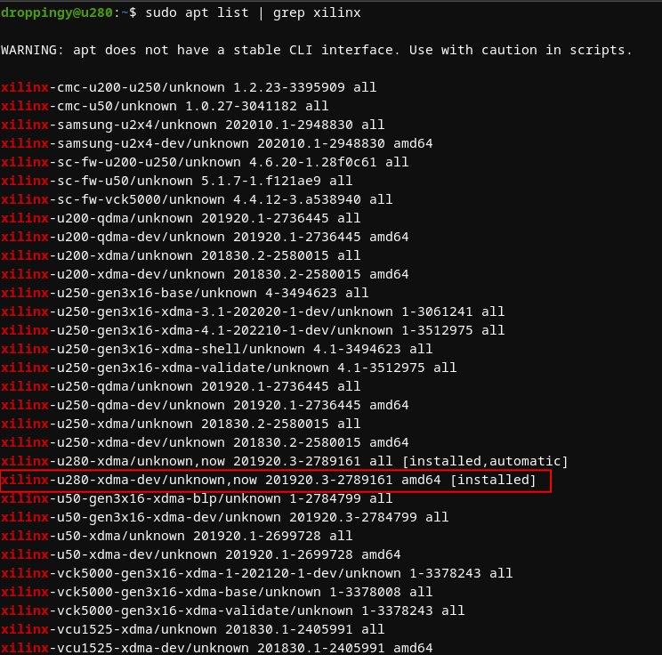
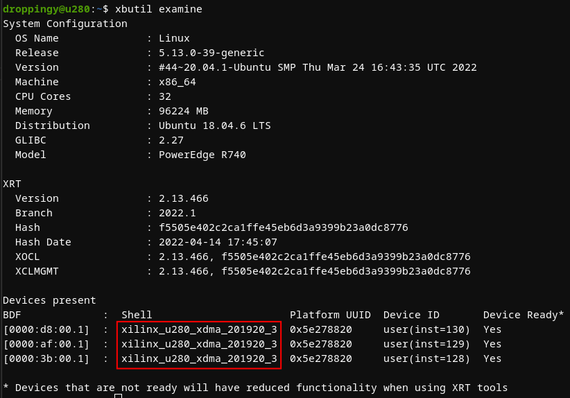
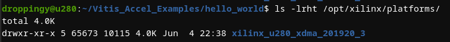
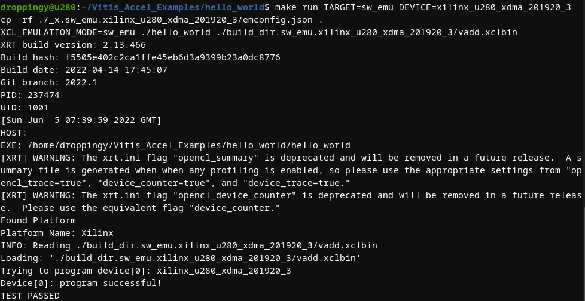
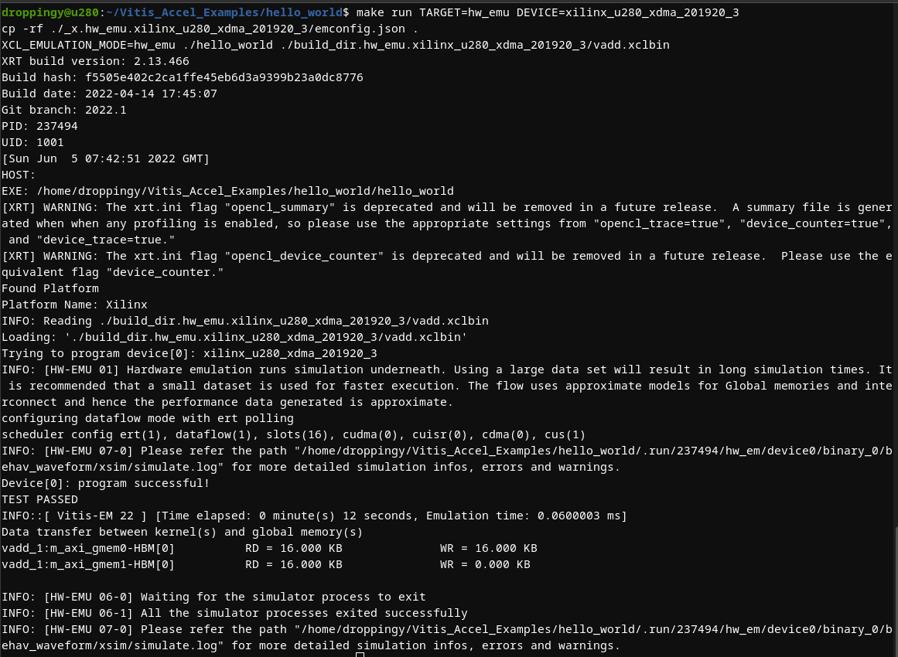
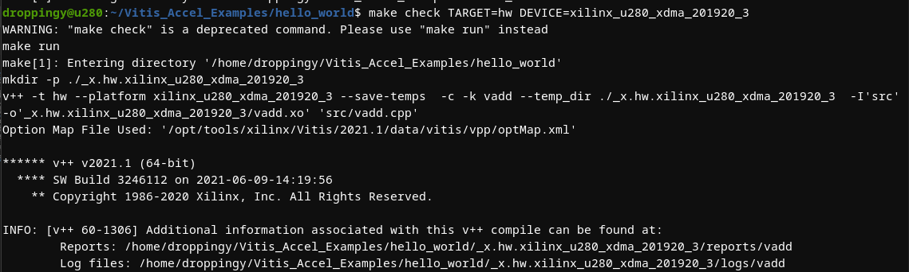
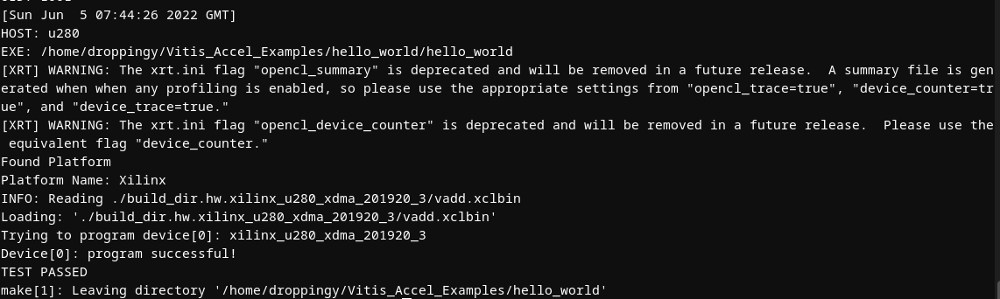
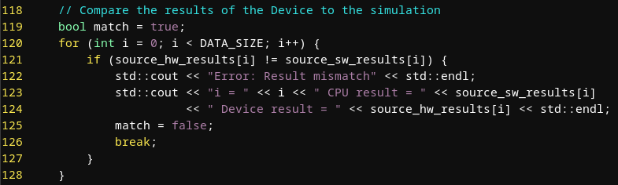
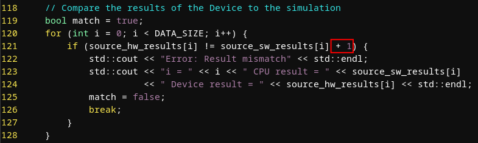
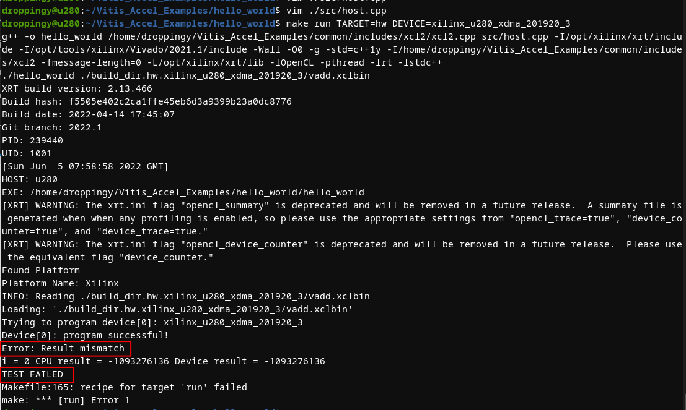

### Experiment Setup
Ubuntu 18.04.6 + U280

### Installations 
1. sudo apt update && sudo apt upgrade
2. sudo apt list | grep xilinx
> search for the development kit  
>   
3. sudo apt install xilinx-u280-xdma-dev
> install the development kit
4. xbutil examine
> check the hardware  
>   
> Device : xilinx_u280_xdma_201920_3  
* (optional) ls -lrht /opt/xilinx/platforms/
> check supported platforms  
> 

5. sudo apt install git ocl-icd-libopencl1 opencl-headers ocl-icd-opencl-dev
> install git and dependencies

### Preperations 
1. git clone https://github.com/Xilinx/Vitis_Accel_Examples.git
> download the source code  
2. cd Vitis_Accel_Examples && git checkout 2021.1
> select a branch
3. source /opt/tools/xilinx/Vitis/2021.1/settings64.sh
> select a version of the tool

### Software Emulation
1. cd hello_world/
2. make run TARGET=sw_emu DEVICE=xilinx_u280_xdma_201920_3
> 

### Hardware Emulation
1. make run TARGET=hw_emu DEVICE=xilinx_u280_xdma_201920_3
> 

### Hardware Verification
1. make run TARGET=hw DEVICE=xilinx_u280_xdma_201920_3
<!-- cmd: /build_dir.hw.xilinx_u280_xdma_201920_3/vadd.xclbin -->
> 
> ....................................................................
> 

### Introduce an error in host.cpp
1. vim ./src/host.cpp
> 
2. modify the condition
> 
3. make run TARGET=hw DEVICE=xilinx_u280_xdma_201920_3
> 
