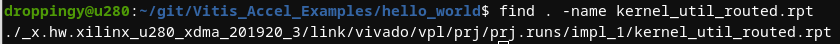

### Resource utilization report
Find the kernel_util_routed.rpt file
> find . -name kernel_util_routed.rpt  
>   

The detailed report is as follow:
> 

### Timing report
Find the timing report file
> find . -name *bb_locked_timing_summary_routed.rpt
> 

The detailed report is as follow:
> 

### Accelerator execution time
original host.cpp

modified host.cpp

execution result

### Summary
|||
|---------|----------------|
|Time     |0.00010536 sec  |
|GOPS     |1.30447e+06     |
|LUT      |7317            |
|LUTAsMem |1173            |  
|REG      |16350           | 
|BRAM     |23              |
|URAM     |0               |
|DSP      |0               |
|WNS      |0.022           |  
